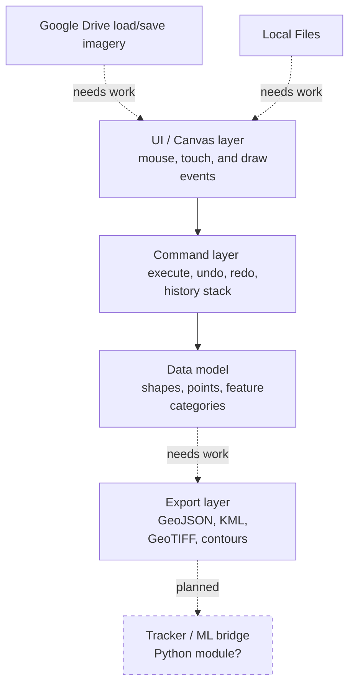

# TRAX Architecture
## Overview
TRAX is a manual meteorological analysis and annotation tool that allows users to upload meteorological maps and create contours that are exported into a .csv. The eventual goal is for the app to serve as an interface to create human-made machine learning training datasets of meteorological features.

**For documentatation of the JavaScript code, [see here.](https://ecaldon.github.io/trax_app/docs/api/)**

## Architecture

## Command Pattern
All actions taken by the user on the canvas are wrapped in a Command pattern, which allows each canvas action to be undone/redone. Each Command has an `execute()` method for when the action is done/redone, and an `undo()` method for when the action is undone. 
