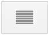
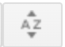

# trax_app
## Meteorological analysis across variables and times in an intuitive, open-source web app

### Want to get started fast? [Watch this video walkthrough](link).
### Run into a bug? Let me know by adding an issue to the repository.

## 1. Uploading Map Images
### 1.1. Sign in to Google Drive
The application uses Google Drive to upload images into the map canvas. This allows you the ability to upload images from your local machine in addition to your images in Google Drive and images shared with you in Google Drive. Currently, a Google account is required to utilize this application. You can [create a Google account here](https://accounts.google.com/lifecycle/steps/signup/name?authuser=0&continue=https://www.google.com/?zx%3D1778036310229&dsh=S2084000910:1778036338131419&ec=futura_exp_og_si_72776762_e&flowEntry=SignUp&flowName=GlifWebSignIn&hl=en&TL=APouJz6okcHlh5FzJoVguW1BxUwSNJM_sCrtO2wZ_zvv9i1baOY89HI_wcTu-MqG), if you don't have one already.

A sign in window will pop up prompting you to sign into Google Drive. You may need to unblock pop-ups in your browser for the TRAX website for this to properly display. The first time you sign in, Google will ask you to allow TRAX to access your Google Drive data. TRAX will never use or save your Google Drive data for anything other than displaying images in the canvas.

> Currently, access to the Google Drive API that makes the app functional is only available to a limited number of people. Contact [Zeke Caldon](mailto:ecaldon@oswego.edu) to request access. The first time you sign in, Google will prompt you that the app has not been verified by Google yet. Click "Continue" to access the app.

### 1.2. Uploading Images

Before uploading images, you'll want to make sure that they have the following properties:
- All layers should have the same set of times and the same number of images.*
- All images should have the same map pixel area for converting coordinates to lat/lon.*

> 
*In a future version, times derived from filenames will be automatically matched from layer to layer.

> 
*Sample code linked here to plot maps for same plot area.

Once you sign in by completing the previous step, the interface will launch the Google Drive Picker. On the top bar, you'll see three tabs, the first is to select images in your Google Drive, the second is to select images shared with you on Google Drive, and the third is to select images from your local machine.

There is a search bar to find specific files or directories.  switches to a list view.  gives different options for sorting images and directories. In the list view, you can also sort by clicking on the column headers.

 You can select multiple consecutive files by holding &#8679; while selecting files, or select multiple non-consecutive files by holding the "option" key. 

> The Google Drive picker interface is not intended for users using tablets or smartphones. In the future, an interface more suitable for selecting multiple files on these devices is desirable to allow these users to enjoy the full functionality of the TRAX app.

When you have your selected files, click  to load the images into the drawing canvas.

## 2. The Drawing Interface & Drawing Contours
### 2.1. The Interface

#### 1. Undo/Redo, Google Drive Upload/Sign Out, Download
- &#8634;: Undoes the previous drawing or contour edit action.
- &#8635;: Redoes any undone drawing or contour edit action.
- Upload: Upload a new layer of map images from Google Drive Picker.
- Download: Download a .zip file of the .pngs of all frames of the drawing canvas, and a .csv of all shapes.
- Sign Out: Sign out of your Google Account.
- ?: Links to this documentation (not shown in screenshot)

#### 2. Frame Display
- Displays current frame number and total number of frames in the map set.

#### 3. Layer Picker
- Drop down menu that selects the map layer when multiple map layers are uploaded.

#### 4. Map Canvas
- Displays the current map frame and layer
- Displays and allows drawing and editing of contours

#### 5. Drawing Tools
- &#8598;: Select tool – Allows the selection and manipulation of contours and their points.
- &#10002;: Pen tool – Allows the creation of a new contour by making the points of the line or closed shape.
- &#10021;: Pan tool – Not yet developed! Doesn't do anything yet!

#### 6. Overlay Last Checkbox
- Displays the last frame's shapes as a translucent overlay when checked

#### 7. Frame Seeker
- Navigate through the frames of a layer using the slider or the &#9204; and &#9205; buttons.

#### 8. Contour Editor
- Color picker: Modifies the color of the selected contour.
- Contour label: Gives the selected contour a name.
- &#9208; : "Pauses" the selected shape on the previous frame. This would denote the end of a certain contour in time, such as the disappation of a cold pool.
- &#10006; : Deletes the selected contour across all frames.

### 2.2. Drawing a Contour
#### 1. Select the &#10002; tool, if it isn't selected already.
#### 2. Point and click on the map canvas to draw points. Consecutive points will have lines drawn between them.
#### 3. Press the Enter/Return key or click on the first point to finish drawing the shape. The selected tool will change to &#8598;.

> If you make a mistake at any time, you can click the &#8634; button to undo your last drawing action.

### 2.3. Editing a Contour's Shape, Appearance, and Name
Once you have drawn a contour, you can make edits, including dragging the contour, its points, and changing its color and label. To edit a contour, click on it in &#8598; mode. White bounding boxes over its points will appear. This means the contour is selected.

#### Dragging a contour
Hover over a contour line and ensure the cursor is &#10021;. Click and drag the contour to the desired place on the canvas. This will edit the contour's position for all *non-edited future frames*.

#### Dragging a contour point
Hover over a contour point and ensure the cursor is . Click and drag the point to the desired place on the canvas. This will edit the contour's points for all *non-edited future frames*.

#### Changing the color of a contour
Click on the colored box in the Contour Editor. Select a color and press the Enter/Return key to change the color of the selected contour across *all frames*.

#### Changing the label of a contour
Click or focus on the "Enter a label..." text box in the Contour Editor. Type the name you want to give the selected contour and press the Enter/Return key to change the name of the selected contour. This name will appear in the .csv export and is the same across *all frames*.

> Again, if you make a mistake at any time, you can click the &#8634; button to undo any of the above actions.

### 2.4. Deleting a Contour
With a contour selected, click the &#10006; button to delete a contour across *all frames*.

> This action can be undone by clicking the &#8634; button.

## 3. Navigating Through Multiple Frames & Map Layers
### 3.1. Changing Frames
You can change frames by pressing the &#9204; or &#9205; keys on your keyboard, clicking the &#9204; or &#9205; buttons in the Frame Seeker panel, or by dragging the slider in the Frame Seeker panel.

### 3.2. Overlay Shapes from the Last Frame
Checking the Overlay Last Checkbox will display the shapes from the previous frame as a transparent overlay on the current frame, unless it is the first frame since there is no "last frame". This can be useful for quickly checking the movement of a contour across two frames while doing analysis.

### 3.3. Adding a New Map Layer
Click "Upload" to upload a new map layer. Follow the instructions in 1.2 to upload the images. The new map layer will display on the canvas, and will be added to the Layer Picker dropdown menu.

> If the number of images is not the same as the other layer(s), an alert will remind you to upload the same number of images and will not load the images into the Drawing Canvas.

### 3.4. Switching Between Map Layers
Click the Layer Picker dropdown menu and select your desired map layer. It will display the same frame from the new layer. Shapes only change from frame to frame, their properties will remain the same across map layers. This system allows you to draw a contour using multiple datasets to aid your analysis. For example, you could analyze a cold front by examining surface observations, satellite imagery, and radar for the same time period.

### 3.5. Starting & Ending a Contour in Time
#### Starting a contour on a specific frame
To start a contour on a specific frame, simply navigate to that frame and draw the contour. *Contours only exist on the frame they are drawn and all future frames*.

#### Ending a contour on a specific frame
To end a contour on a specific frame, select the contour and click the &#9208; button to end the contour on the previous frame. For example, if you go to frame 7, select the contour and click &#9208;, it will last exist on frame 6. This is useful for when an analyzed feature disappates or moves off the screen.
> This action can be undone by clicking the &#8634; button.

## 4. Download and Work With Shape Data and Analysis Images
### 4.1. Downloading Data & Analysis Images
Click the Download button to download shape data and the images of your analysis as a `.zip` file. The `.zip` file will contain:
- A `.csv` file containing data on the shapes, described in 4.2.
- Folder named `canvas_images` containing `.png` images of the Drawing Canvas for every frame of every layer.

### 4.2. Working with the Shape Data `.csv` File
The shape data `.csv` file contains the following variables:

| Variable            | Explanation                                                                     |
|---------------------|---------------------------------------------------------------------------------|
| num                 | Numerical ID for the shape                                                      |
| label               | User-inputted label for the shape                                               |
| closed              | Boolean denoting if the shape is a closed polygon or an open contour            |
| frame_num           | Frame number for the following layer filenames and point coordinates            |
| layer_`n`_filename* | Filename of the image for each layer on the frame number specified by the row   |
| coord_`n`_x*        | X coordinate of the n point on the shape and frame number specified by the row  |
| coord_`n`_y*        | Y coordinate of the n point on the shape and frame number specified by the row  |

> \*These variables will have multiple iterations based on the number of layers and points in the shape.

#### TODO: Converting the x and y Coordinates to Longitude & Latitude